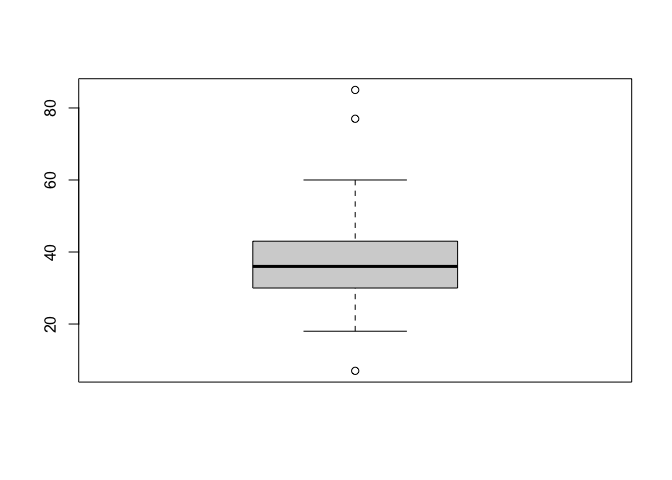
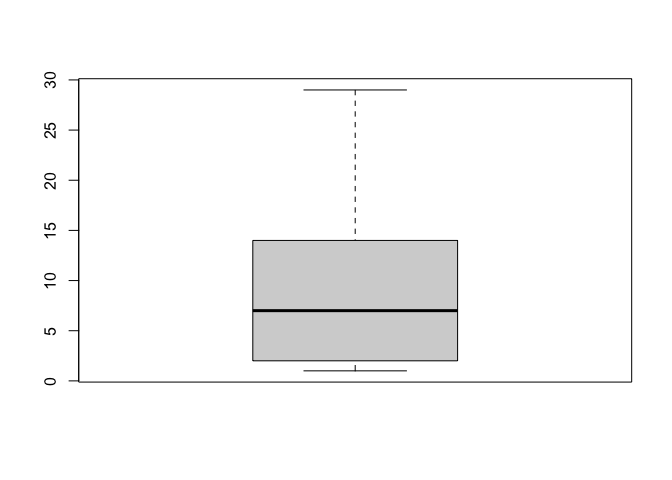
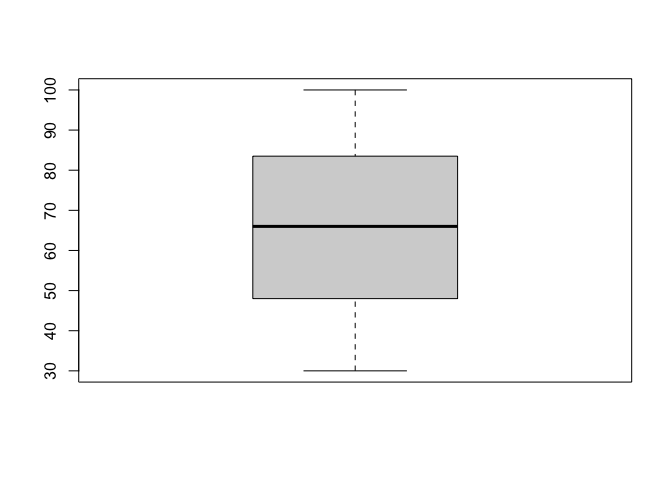
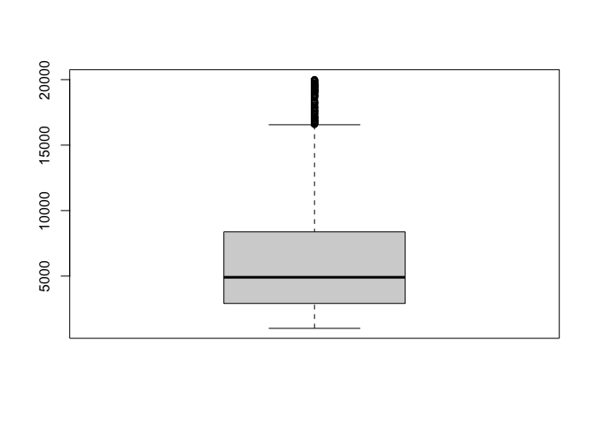
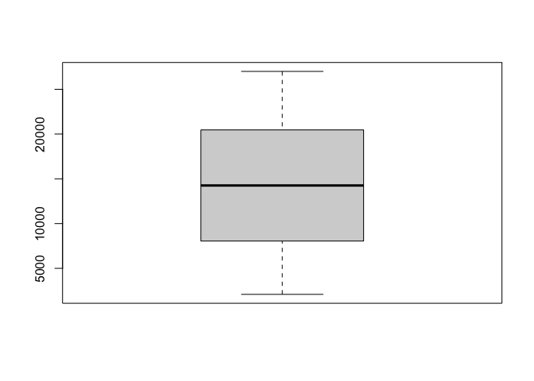
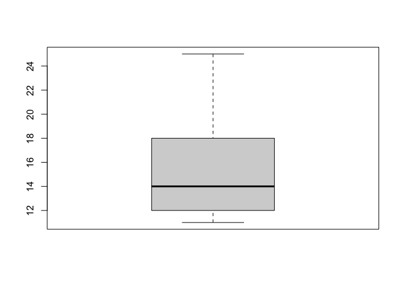

Data Cleaning, Descriptive Analysis and Correlation Measures
================

``` r
library(ggplot2)
library(readxl)
library(tidyverse)
```

    ## ── Attaching core tidyverse packages ──────────────────────── tidyverse 2.0.0 ──
    ## ✔ dplyr     1.1.3     ✔ readr     2.1.4
    ## ✔ forcats   1.0.0     ✔ stringr   1.5.0
    ## ✔ lubridate 1.9.2     ✔ tibble    3.2.1
    ## ✔ purrr     1.0.2     ✔ tidyr     1.3.0
    ## ── Conflicts ────────────────────────────────────────── tidyverse_conflicts() ──
    ## ✖ dplyr::filter() masks stats::filter()
    ## ✖ dplyr::lag()    masks stats::lag()
    ## ℹ Use the conflicted package (<http://conflicted.r-lib.org/>) to force all conflicts to become errors

``` r
library(arsenal)
```

    ## 
    ## Attaching package: 'arsenal'
    ## 
    ## The following object is masked from 'package:lubridate':
    ## 
    ##     is.Date

``` r
#located the data at the specified file path and stores the data in a variable called "data"
data <- read_excel("/Users/jaimerd/Desktop/master/Human Resources Analytics /data.xlsx")
```

    ## Warning in read_fun(path = path, sheet_i = sheet, limits = limits, shim = shim,
    ## : NA inserted for an unsupported date prior to 1900

``` r
#summary of the data
summary(data)
```

    ##        ID              Age             DOB                         
    ##  Min.   :   1.0   Min.   : 7.00   Min.   :1936-09-02 00:00:00.000  
    ##  1st Qu.: 367.5   1st Qu.:30.00   1st Qu.:1978-09-08 00:00:00.000  
    ##  Median : 734.0   Median :36.00   Median :1985-09-09 00:00:00.000  
    ##  Mean   : 734.0   Mean   :36.97   Mean   :1984-09-13 13:09:44.447  
    ##  3rd Qu.:1100.5   3rd Qu.:43.00   3rd Qu.:1991-09-11 00:00:00.000  
    ##  Max.   :1467.0   Max.   :85.00   Max.   :2003-09-12 00:00:00.000  
    ##                                   NA's   :1                        
    ##   TravelFreq         BillableRate     Department        DistanceFromHome
    ##  Length:1467        Min.   : 102.0   Length:1467        Min.   : 1.000  
    ##  Class :character   1st Qu.: 465.0   Class :character   1st Qu.: 2.000  
    ##  Mode  :character   Median : 802.0   Mode  :character   Median : 7.000  
    ##                     Mean   : 802.9                      Mean   : 9.202  
    ##                     3rd Qu.:1157.5                      3rd Qu.:14.000  
    ##                     Max.   :1499.0                      Max.   :29.000  
    ##                                                                         
    ##    Education     EducationField     EnvironmentSatisfaction    Gender         
    ##  Min.   :1.000   Length:1467        Min.   :1.000           Length:1467       
    ##  1st Qu.:2.000   Class :character   1st Qu.:2.000           Class :character  
    ##  Median :3.000   Mode  :character   Median :3.000           Mode  :character  
    ##  Mean   :2.913                      Mean   :2.722                             
    ##  3rd Qu.:4.000                      3rd Qu.:4.000                             
    ##  Max.   :5.000                      Max.   :4.000                             
    ##                                                                               
    ##  HourlyPayRate    JobInvolvement     JobLevel       JobRole         
    ##  Min.   : 30.00   Min.   :1.000   Min.   :1.000   Length:1467       
    ##  1st Qu.: 48.00   1st Qu.:2.000   1st Qu.:1.000   Class :character  
    ##  Median : 66.00   Median :3.000   Median :2.000   Mode  :character  
    ##  Mean   : 65.87   Mean   :2.729   Mean   :2.064                     
    ##  3rd Qu.: 83.50   3rd Qu.:3.000   3rd Qu.:3.000                     
    ##  Max.   :100.00   Max.   :4.000   Max.   :5.000                     
    ##                                                                     
    ##  JobSatisfaction MaritalStatus      MonthlyIncome    MonthlyRate   
    ##  Min.   :1.000   Length:1467        Min.   : 1009   Min.   : 2094  
    ##  1st Qu.:2.000   Class :character   1st Qu.: 2910   1st Qu.: 8049  
    ##  Median :3.000   Mode  :character   Median : 4908   Median :14255  
    ##  Mean   :2.729                      Mean   : 6505   Mean   :14323  
    ##  3rd Qu.:4.000                      3rd Qu.: 8380   3rd Qu.:20464  
    ##  Max.   :4.000                      Max.   :19999   Max.   :26999  
    ##                                                                    
    ##  NumCompaniesWorked    Over18            OverTime         PercentSalaryHike
    ##  Min.   :0.000      Length:1467        Length:1467        Min.   :11.00    
    ##  1st Qu.:1.000      Class :character   Class :character   1st Qu.:12.00    
    ##  Median :2.000      Mode  :character   Mode  :character   Median :14.00    
    ##  Mean   :2.695                                            Mean   :15.21    
    ##  3rd Qu.:4.000                                            3rd Qu.:18.00    
    ##  Max.   :9.000                                            Max.   :25.00    
    ##                                                                            
    ##  PerformanceRating RelationshipSatisfaction StandardHours StockOptionLevel
    ##  Min.   :3.000     Min.   :1.000            Min.   :40    Min.   :0.0000  
    ##  1st Qu.:3.000     1st Qu.:2.000            1st Qu.:40    1st Qu.:0.0000  
    ##  Median :3.000     Median :3.000            Median :40    Median :1.0000  
    ##  Mean   :3.153     Mean   :2.713            Mean   :40    Mean   :0.7948  
    ##  3rd Qu.:3.000     3rd Qu.:4.000            3rd Qu.:40    3rd Qu.:1.0000  
    ##  Max.   :4.000     Max.   :4.000            Max.   :40    Max.   :3.0000  
    ##                                                                           
    ##  TotalWorkingYears TrainingTimesLastYear WorkLifeBalance YearsAtCompany 
    ##  Min.   : 0.00     Min.   :0.000         Min.   :1.000   Min.   : 0.00  
    ##  1st Qu.: 6.00     1st Qu.:2.000         1st Qu.:2.000   1st Qu.: 3.00  
    ##  Median :10.00     Median :3.000         Median :3.000   Median : 5.00  
    ##  Mean   :11.32     Mean   :2.801         Mean   :2.761   Mean   : 7.01  
    ##  3rd Qu.:15.00     3rd Qu.:3.000         3rd Qu.:3.000   3rd Qu.: 9.00  
    ##  Max.   :94.00     Max.   :6.000         Max.   :4.000   Max.   :40.00  
    ##                                                                         
    ##  YearsInCurrentRole YearsSinceLastPromotion YearsWithCurrManager
    ##  Min.   : 0.00      Min.   : 0.000          Min.   : 0.000      
    ##  1st Qu.: 2.00      1st Qu.: 0.000          1st Qu.: 2.000      
    ##  Median : 3.00      Median : 1.000          Median : 3.000      
    ##  Mean   : 4.23      Mean   : 2.192          Mean   : 4.123      
    ##  3rd Qu.: 7.00      3rd Qu.: 3.000          3rd Qu.: 7.000      
    ##  Max.   :18.00      Max.   :15.000          Max.   :17.000      
    ##                                                                 
    ##   Attrition        
    ##  Length:1467       
    ##  Class :character  
    ##  Mode  :character  
    ##                    
    ##                    
    ##                    
    ## 

Feature engineering

``` r
#convert character (text) variables into factors
data <- data %>% mutate_if(is.character,as.factor)

#convert ordinal and categorical variables into factors
colums_factor <- c("Education", "EnvironmentSatisfaction", "JobInvolvement", "JobLevel", "JobSatisfaction", "PerformanceRating", "RelationshipSatisfaction", "StockOptionLevel", "WorkLifeBalance")
data[colums_factor] <- lapply(data[colums_factor], as.factor)
```

## Incorrect Data

``` r
#department  
data <- data %>% 
  mutate(Department = recode(Department, 'HR' = 'Human Resources')) %>%
  mutate(Department = recode(Department, 'R & D' = "Research & Development"))
```

## Check for outliers

``` r
#Age
boxplot(data$Age)
```

<!-- -->

``` r
summary(data$Age)
```

    ##    Min. 1st Qu.  Median    Mean 3rd Qu.    Max. 
    ##    7.00   30.00   36.00   36.97   43.00   85.00

``` r
data %>% count(Age>70) 
```

    ## # A tibble: 2 × 2
    ##   `Age > 70`     n
    ##   <lgl>      <int>
    ## 1 FALSE       1465
    ## 2 TRUE           2

``` r
data %>% count(Age<18)
```

    ## # A tibble: 2 × 2
    ##   `Age < 18`     n
    ##   <lgl>      <int>
    ## 1 FALSE       1466
    ## 2 TRUE           1

``` r
data$Age[data$Age > 70] <- NA
data$Age[data$Age < 10] <- NA

#Billable Rate
boxplot(data$BillableRate)
```

<!-- -->

``` r
#Distance From Home 
boxplot(data$DistanceFromHome)
```

<!-- -->

``` r
#Hourly pay rate
boxplot(data$HourlyPayRate)
```

<!-- -->

``` r
#Monthly income
boxplot(data$MonthlyIncome)
```

<!-- -->

``` r
summary(data$MonthlyIncome)
```

    ##    Min. 1st Qu.  Median    Mean 3rd Qu.    Max. 
    ##    1009    2910    4908    6505    8380   19999

``` r
#Monthly rate
boxplot(data$MonthlyRate)
```

<!-- -->

``` r
#Salary hike
boxplot(data$PercentSalaryHike)
```

<!-- -->

``` r
#Years with current manager
table(data$YearsWithCurrManager)
```

    ## 
    ##   0   1   2   3   4   5   6   7   8   9  10  11  12  13  14  15  16  17 
    ## 263  76 343 141  98  31  29 216 106  64  27  22  18  14   5   5   2   7

``` r
#exclude ID, DOB and Over 18 variables because they are not going to have any implications in the model 
data <- data %>%  select(-ID)
data <- data %>%  select(-DOB)
data <-data %>% select(-Over18)
```

## Statistic summary and correlation analysis

ANOVA Test for numerical variables and Chi Squared Test for categotical
Variables. Takin \<0.01 as the reference value

``` r
my_controls <- tableby.control(
  test = T,
  total = FALSE,
  numeric.test = "anova", cat.test = "chisq",
  numeric.stats = c("meansd"),
  cat.stats = c("countpct"),
  )

descriptive_stats <- tableby(Attrition ~ .,
                             data = data,
                             control = my_controls)
```

    ## Warning in anova.lm(aov.out): ANOVA F-tests on an essentially perfect fit are
    ## unreliable

``` r
summary(descriptive_stats, title = "Descriptive Statistic", text= TRUE)
```

    ## 
    ## 
    ## Table: Descriptive Statistic
    ## 
    ## |                             |     No (N=1186)      |     Yes (N=281)      | p value|
    ## |:----------------------------|:--------------------:|:--------------------:|-------:|
    ## |Age                          |                      |                      | < 0.001|
    ## |-  Mean (SD)                 |    37.615 (8.869)    |    34.018 (9.677)    |        |
    ## |TravelFreq                   |                      |                      | < 0.001|
    ## |-  Frequently                |     201 (16.9%)      |      75 (26.7%)      |        |
    ## |-  None                      |     133 (11.2%)      |      17 (6.0%)       |        |
    ## |-  Rarely                    |     852 (71.8%)      |     189 (67.3%)      |        |
    ## |BillableRate                 |                      |                      |   0.089|
    ## |-  Mean (SD)                 |  811.621 (403.089)   |  766.068 (403.877)   |        |
    ## |Department                   |                      |                      | < 0.001|
    ## |-  Human Resources           |      51 (4.3%)       |      12 (4.3%)       |        |
    ## |-  Research & Development    |     826 (69.6%)      |     133 (47.3%)      |        |
    ## |-  Sales                     |     309 (26.1%)      |     136 (48.4%)      |        |
    ## |DistanceFromHome             |                      |                      | < 0.001|
    ## |-  Mean (SD)                 |    8.711 (7.806)     |    11.274 (9.016)    |        |
    ## |Education                    |                      |                      |   0.410|
    ## |-  1                         |     133 (11.2%)      |      37 (13.2%)      |        |
    ## |-  2                         |     229 (19.3%)      |      53 (18.9%)      |        |
    ## |-  3                         |     452 (38.1%)      |     117 (41.6%)      |        |
    ## |-  4                         |     330 (27.8%)      |      68 (24.2%)      |        |
    ## |-  5                         |      42 (3.5%)       |       6 (2.1%)       |        |
    ## |EducationField               |                      |                      | < 0.001|
    ## |-  Human Resources           |      20 (1.7%)       |       7 (2.5%)       |        |
    ## |-  Life Sciences             |     504 (42.5%)      |     101 (35.9%)      |        |
    ## |-  Marketing                 |      108 (9.1%)      |      51 (18.1%)      |        |
    ## |-  Medical                   |     389 (32.8%)      |      73 (26.0%)      |        |
    ## |-  Other                     |      69 (5.8%)       |      13 (4.6%)       |        |
    ## |-  Technical Degree          |      96 (8.1%)       |      36 (12.8%)      |        |
    ## |EnvironmentSatisfaction      |                      |                      | < 0.001|
    ## |-  1                         |     204 (17.2%)      |      80 (28.5%)      |        |
    ## |-  2                         |     236 (19.9%)      |      49 (17.4%)      |        |
    ## |-  3                         |     374 (31.5%)      |      79 (28.1%)      |        |
    ## |-  4                         |     372 (31.4%)      |      73 (26.0%)      |        |
    ## |Gender                       |                      |                      |   0.623|
    ## |-  Female                    |     479 (40.4%)      |     109 (38.8%)      |        |
    ## |-  Male                      |     707 (59.6%)      |     172 (61.2%)      |        |
    ## |HourlyPayRate                |                      |                      |   0.878|
    ## |-  Mean (SD)                 |   65.828 (20.338)    |   66.036 (20.373)    |        |
    ## |JobInvolvement               |                      |                      | < 0.001|
    ## |-  1                         |      54 (4.6%)       |      29 (10.3%)      |        |
    ## |-  2                         |     291 (24.5%)      |      83 (29.5%)      |        |
    ## |-  3                         |     714 (60.2%)      |     154 (54.8%)      |        |
    ## |-  4                         |     127 (10.7%)      |      15 (5.3%)       |        |
    ## |JobLevel                     |                      |                      | < 0.001|
    ## |-  1                         |     400 (33.7%)      |     143 (50.9%)      |        |
    ## |-  2                         |     449 (37.9%)      |      82 (29.2%)      |        |
    ## |-  3                         |     175 (14.8%)      |      43 (15.3%)      |        |
    ## |-  4                         |      98 (8.3%)       |       8 (2.8%)       |        |
    ## |-  5                         |      64 (5.4%)       |       5 (1.8%)       |        |
    ## |JobRole                      |                      |                      | < 0.001|
    ## |-  Healthcare Representative |     122 (10.3%)      |       9 (3.2%)       |        |
    ## |-  Human Resources           |      40 (3.4%)       |      12 (4.3%)       |        |
    ## |-  Laboratory Technician     |     196 (16.5%)      |      62 (22.1%)      |        |
    ## |-  Manager                   |      97 (8.2%)       |       5 (1.8%)       |        |
    ## |-  Manufacturing Director    |     134 (11.3%)      |      10 (3.6%)       |        |
    ## |-  Research Director         |      78 (6.6%)       |       2 (0.7%)       |        |
    ## |-  Research Scientist        |     245 (20.7%)      |      47 (16.7%)      |        |
    ## |-  Sales Executive           |     224 (18.9%)      |     101 (35.9%)      |        |
    ## |-  Sales Representative      |      50 (4.2%)       |      33 (11.7%)      |        |
    ## |JobSatisfaction              |                      |                      |   0.004|
    ## |-  1                         |     214 (18.0%)      |      75 (26.7%)      |        |
    ## |-  2                         |     225 (19.0%)      |      53 (18.9%)      |        |
    ## |-  3                         |     358 (30.2%)      |      83 (29.5%)      |        |
    ## |-  4                         |     389 (32.8%)      |      70 (24.9%)      |        |
    ## |MaritalStatus                |                      |                      | < 0.001|
    ## |-  Divorced                  |     284 (23.9%)      |      43 (15.3%)      |        |
    ## |-  Married                   |     561 (47.3%)      |     109 (38.8%)      |        |
    ## |-  Single                    |     341 (28.8%)      |     129 (45.9%)      |        |
    ## |MonthlyIncome                |                      |                      | < 0.001|
    ## |-  Mean (SD)                 | 6825.481 (4881.365)  | 5154.278 (3627.306)  |        |
    ## |MonthlyRate                  |                      |                      |   0.968|
    ## |-  Mean (SD)                 | 14326.472 (7086.979) | 14307.548 (7271.578) |        |
    ## |NumCompaniesWorked           |                      |                      |   0.065|
    ## |-  Mean (SD)                 |    2.637 (2.462)     |    2.943 (2.646)     |        |
    ## |OverTime                     |                      |                      | < 0.001|
    ## |-  No                        |     926 (78.1%)      |     126 (44.8%)      |        |
    ## |-  Yes                       |     260 (21.9%)      |     155 (55.2%)      |        |
    ## |PercentSalaryHike            |                      |                      |   0.653|
    ## |-  Mean (SD)                 |    15.230 (3.640)    |    15.121 (3.750)    |        |
    ## |PerformanceRating            |                      |                      |   0.868|
    ## |-  3                         |     1005 (84.7%)     |     237 (84.3%)      |        |
    ## |-  4                         |     181 (15.3%)      |      44 (15.7%)      |        |
    ## |RelationshipSatisfaction     |                      |                      |   0.336|
    ## |-  1                         |     212 (17.9%)      |      63 (22.4%)      |        |
    ## |-  2                         |     250 (21.1%)      |      52 (18.5%)      |        |
    ## |-  3                         |     373 (31.5%)      |      86 (30.6%)      |        |
    ## |-  4                         |     351 (29.6%)      |      80 (28.5%)      |        |
    ## |StandardHours                |                      |                      |   0.040|
    ## |-  Mean (SD)                 |    40.000 (0.000)    |    40.000 (0.000)    |        |
    ## |StockOptionLevel             |                      |                      | < 0.001|
    ## |-  0                         |     459 (38.7%)      |     170 (60.5%)      |        |
    ## |-  1                         |     520 (43.8%)      |      75 (26.7%)      |        |
    ## |-  2                         |     140 (11.8%)      |      18 (6.4%)       |        |
    ## |-  3                         |      67 (5.6%)       |      18 (6.4%)       |        |
    ## |TotalWorkingYears            |                      |                      | < 0.001|
    ## |-  Mean (SD)                 |    11.864 (7.773)    |    9.011 (8.713)     |        |
    ## |TrainingTimesLastYear        |                      |                      |   0.015|
    ## |-  Mean (SD)                 |    2.841 (1.295)     |    2.633 (1.250)     |        |
    ## |WorkLifeBalance              |                      |                      |   0.013|
    ## |-  1                         |      55 (4.6%)       |      25 (8.9%)       |        |
    ## |-  2                         |     275 (23.2%)      |      68 (24.2%)      |        |
    ## |-  3                         |     738 (62.2%)      |     154 (54.8%)      |        |
    ## |-  4                         |      118 (9.9%)      |      34 (12.1%)      |        |
    ## |YearsAtCompany               |                      |                      | < 0.001|
    ## |-  Mean (SD)                 |    7.384 (6.120)     |    5.431 (5.940)     |        |
    ## |YearsInCurrentRole           |                      |                      | < 0.001|
    ## |-  Mean (SD)                 |    4.494 (3.640)     |    3.117 (3.349)     |        |
    ## |YearsSinceLastPromotion      |                      |                      |   0.325|
    ## |-  Mean (SD)                 |    2.232 (3.228)     |    2.021 (3.210)     |        |
    ## |YearsWithCurrManager         |                      |                      | < 0.001|
    ## |-  Mean (SD)                 |    4.368 (3.601)     |    3.089 (3.243)     |        |
